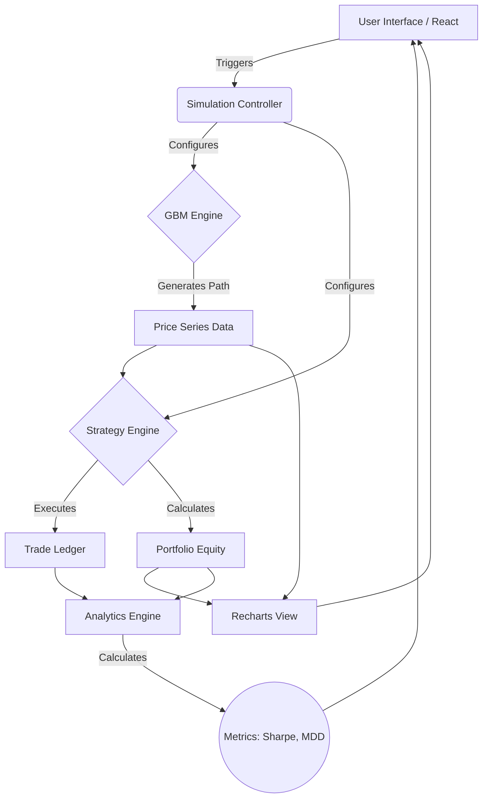

<div align="center">

# 📈 Bitcoin GBM Simulation Dashboard

**A modern quantitative finance platform that simulates Bitcoin price movements using Geometric Brownian Motion (GBM), backtests trading strategies, and visualizes portfolio performance through an interactive dashboard.**

[](https://nextjs.org/)
[](https://react.dev/)
[](https://www.typescriptlang.org/)
[](https://tailwindcss.com/)
[](https://opensource.org/licenses/MIT)
[](http://makeapullrequest.com)

<br />

<!-- placeholder for animated GIF -->


<br />

[Live Demo](#) · [Report Bug](#) · [Request Feature](#)

</div>

---

## 📖 About The Project

Bridging the gap between institutional-grade quantitative finance and modern web development, the **Bitcoin GBM Simulation Dashboard** is a state-of-the-art educational and research platform. It leverages stochastic calculus—specifically **Geometric Brownian Motion (GBM)**—to model potential future price paths of Bitcoin, providing a rigorous mathematical foundation for financial simulation.

**Why Geometric Brownian Motion?**
GBM is the standard model for asset price dynamics in continuous time, underlying the famous Black-Scholes options pricing formula. By modeling logarithmic returns as normally distributed and incorporating both deterministic drift and stochastic volatility, GBM provides a realistic, continuous-time framework that ensures prices never drop below zero. 

**Educational & Research Value**
This project demystifies quantitative finance for software engineers and data scientists. It provides an intuitive, visual, and highly interactive environment to observe how mathematical models translate into market behavior, allowing users to backtest algorithmic trading strategies (like Moving Average Crossovers) against mathematically generated market conditions.

---

## ✨ Key Highlights

<div align="center">
<table>
  <tr>
    <td width="33%">
      <h3>🧬 Stochastic Modeling</h3>
      <p>Institutional-grade Geometric Brownian Motion engine simulating continuous asset paths.</p>
    </td>
    <td width="33%">
      <h3>📈 Strategy Backtesting</h3>
      <p>Built-in algorithmic trading simulator comparing Moving Average strategies vs. Buy & Hold.</p>
    </td>
    <td width="33%">
      <h3>⚡ Real-Time Analytics</h3>
      <p>Instant calculation of Sharpe Ratio, Maximum Drawdown, and cumulative returns.</p>
    </td>
  </tr>
  <tr>
    <td width="33%">
      <h3>🎨 Modern Dashboard</h3>
      <p>Pixel-perfect UI built with Next.js, Tailwind CSS, Recharts, and Framer Motion.</p>
    </td>
    <td width="33%">
      <h3>📊 Data Export</h3>
      <p>Seamless one-click export of simulation data to CSV and charts to PNG.</p>
    </td>
    <td width="33%">
      <h3>🛡️ Type-Safe Architecture</h3>
      <p>100% TypeScript codebase ensuring robust, error-free financial calculations.</p>
    </td>
  </tr>
</table>
</div>

---

## 🚀 Feature List

### Core Simulation Engine
* **Geometric Brownian Motion (GBM)**: Generates statistically rigorous 60-day Bitcoin price paths.
* **Configurable Market Parameters**: Adjust Initial Price, Annual Volatility ($\sigma$), and Annual Drift ($\mu$) to simulate bull, bear, or volatile markets.
* **Random Walk Generation**: Utilizes pseudo-random standard normal distributions for stochastic variance.

### Algorithmic Trading & Backtesting
* **Moving Average Crossover Strategy**: Implements a short/long moving average strategy reacting dynamically to the generated price path.
* **Buy & Hold Benchmark**: Compares active trading performance against a passive holding strategy.
* **Daily Trading Log**: Detailed transactional ledger tracking every buy, sell, and hold decision.

### Interactive Portfolio Dashboard
* **Real-Time Portfolio Tracking**: Tracks cash balance, asset holdings, and total equity at each simulation step.
* **Portfolio Equity Curve**: Visualizes wealth accumulation over the 60-day period.
* **Price Charts**: Interactive Recharts integration for exploring the generated GBM path and MA indicators.

### Performance Analytics
* **Sharpe Ratio**: Calculates risk-adjusted returns using standard financial metrics.
* **Maximum Drawdown**: Identifies the largest peak-to-trough drop in portfolio value.
* **Total Return**: Absolute and percentage return metrics for strategy evaluation.

### User Experience & Utility
* **Playback Animation**: Watch the simulation unfold step-by-step with adjustable playback speed.
* **Responsive Design**: Flawless experience across desktop, tablet, and mobile.
* **Dark Mode Optimization**: Deep, contrast-rich aesthetic tailored for financial applications.
* **Export Capabilities**: Download historical simulation data as CSV and capture beautiful PNG snapshots of your charts.

---

## 🧭 Dashboard Walkthrough

1. **Parameter Configuration Panel**: Located on the left (or top on mobile), this is the control center. Here you set the mathematical parameters of the GBM (Drift, Volatility) and the algorithmic strategy (Short MA, Long MA).
2. **Main Price Chart**: The central visualization overlaying the GBM price path with your selected moving averages. It updates in real-time as the simulation runs.
3. **Equity Curve**: A secondary chart plotting the total portfolio value over time, comparing the active strategy against Buy & Hold.
4. **Key Metrics Ribbon**: A top-level display of critical performance indicators: Final Portfolio Value, Total Return %, Sharpe Ratio, and Max Drawdown.
5. **Trade Ledger**: A scrollable data table at the bottom documenting the chronological sequence of trades, execution prices, and resulting capital balances.

---

## 🧮 Mathematical Background

This dashboard is built on robust quantitative models. Here are the core formulas driving the engine.

### Geometric Brownian Motion (GBM)
The continuous-time stochastic process used to model the Bitcoin price $S_t$:

$$
dS_t = \mu S_t dt + \sigma S_t dW_t
$$

Where:
- $S_t$ = Asset price at time $t$
- $\mu$ = Percentage drift (expected return)
- $\sigma$ = Percentage volatility
- $dW_t$ = Wiener process (Brownian motion) increment

For discrete daily simulation, we use the exact solution:

$$
S_{t+\Delta t} = S_t \exp\left( \left(\mu - \frac{\sigma^2}{2}\right)\Delta t + \sigma \sqrt{\Delta t} Z \right)
$$
*(Where $Z \sim N(0,1)$ is a standard normal random variable)*

### Moving Average Strategy
A simple trend-following algorithm. We define the Moving Average at time $t$ for period $n$ as:

$$
MA(n)_t = \frac{1}{n} \sum_{i=0}^{n-1} S_{t-i}
$$

**Trading Signal:**
- **Buy:** When $MA(short) > MA(long)$
- **Sell:** When $MA(short) < MA(long)$

### Performance Metrics

**Sharpe Ratio (Annualized)**
Measures risk-adjusted return:

$$
\text{Sharpe Ratio} = \frac{R_p - R_f}{\sigma_p} \times \sqrt{252}
$$
*(Where $R_p$ is portfolio return, $R_f$ is risk-free rate, and $\sigma_p$ is portfolio standard deviation)*

**Maximum Drawdown (MDD)**
Measures the largest single drop from peak to bottom:

$$
MDD = \max_{\tau \in (0, T)} \left( \max_{t \in (0, \tau)} \frac{V_t - V_\tau}{V_t} \right)
$$

---

## 🏗️ Architecture



---

## 📁 Folder Structure

```text
bitcoin-gbm-dashboard/
├── src/
│   ├── app/                 # Next.js 15 App Router pages & layouts
│   │   ├── layout.tsx
│   │   ├── page.tsx
│   │   └── globals.css
│   ├── components/          # Reusable React components
│   │   ├── charts/          # Recharts wrappers
│   │   ├── dashboard/       # Main dashboard layout
│   │   ├── ui/              # shadcn/ui inspired primitives
│   │   └── control-panel/   # Parameter inputs
│   ├── lib/                 # Core quantitative logic & mathematics
│   │   ├── gbm.ts           # Stochastic calculus engine
│   │   ├── backtest.ts      # Trading strategy simulator
│   │   ├── metrics.ts       # Sharpe, Sortino, Drawdown calcs
│   │   └── utils.ts         # Formatting and helpers
│   ├── types/               # TypeScript interfaces
│   └── hooks/               # Custom React hooks (e.g., useSimulation)
├── public/                  # Static assets
├── package.json
├── tailwind.config.ts
└── tsconfig.json
```

---

## 🛠️ Tech Stack

<div align="center">

| Category | Technology | Purpose |
| :--- | :--- | :--- |
| **Framework** | Next.js 15 | App Router, Server/Client components, SSR |
| **Library** | React 19 | UI rendering, state management |
| **Language** | TypeScript | End-to-end type safety for financial math |
| **Styling** | Tailwind CSS | Utility-first, responsive dark-mode styling |
| **Visualization**| Recharts | Interactive, declarative SVG charts |
| **Animation** | Framer Motion | Fluid UI transitions and playback animations |
| **Icons** | Lucide React | Clean, consistent vector iconography |

</div>

---

## ⚙️ Installation

To run this project locally, ensure you have **Node.js 18+** installed.

1. **Clone the repository**
   ```bash
   git clone https://github.com/yourusername/bitcoin-gbm-dashboard.git
   cd bitcoin-gbm-dashboard
   ```

2. **Install dependencies**
   ```bash
   npm install
   # or
   yarn install
   # or
   pnpm install
   ```

3. **Start the development server**
   ```bash
   npm run dev
   ```

4. **Open the application**
   Navigate to [http://localhost:3000](http://localhost:3000) in your browser.

---

## 📸 Screenshots

<details>
<summary><b>View Dashboard Screenshots</b></summary>
<br/>

*Note: Replace with actual screenshots before deployment.*

**Main Dashboard View**


**Analytics & Trade Ledger**


</details>

---

## 📖 Usage Guide

1. **Configure Parameters**: Use the sidebar to set your initial Bitcoin price, expected annual drift (e.g., 50% for a bull market), and volatility (e.g., 80% for high variance).
2. **Set Strategy Specs**: Adjust the short and long moving average window sizes.
3. **Run Simulation**: Click "Simulate" to instantly generate a 60-day price path and backtest the strategy.
4. **Watch Playback**: Use the "Play" button to watch the simulation unfold day-by-day, simulating real-time market observation.
5. **Analyze Metrics**: Review the top ribbon to see if your strategy outperformed a simple Buy & Hold via the Sharpe Ratio and Total Return.
6. **Export Reports**: Click "Export CSV" to download the daily ledger for external analysis in Python or Excel.

---

## 📡 API (Quantitative Library)

The core logic can be extracted and used as a standalone Node.js library.

```typescript
import { generateGBMPath } from '@/lib/gbm';
import { runBacktest } from '@/lib/backtest';

// 1. Generate 60 days of BTC prices
const pricePath = generateGBMPath({
  initialPrice: 65000,
  drift: 0.5,
  volatility: 0.8,
  days: 60
});

// 2. Run Moving Average Crossover Strategy
const results = runBacktest(pricePath, {
  shortWindow: 5,
  longWindow: 15,
  initialCapital: 100000
});

console.log(`Final Equity: $${results.finalEquity}`);
console.log(`Sharpe Ratio: ${results.metrics.sharpeRatio}`);
```

---

## 🧠 Project Philosophy

1. **Math First, UI Second**: The underlying simulations must be mathematically rigorous. Pseudo-random number generation utilizes Box-Muller transforms to ensure standard normal distributions necessary for true Brownian motion.
2. **Zero-Latency Reactivity**: Financial tools require instant feedback. The architecture is designed to re-calculate complex 60-day backtests in milliseconds upon slider adjustments.
3. **Institutional Aesthetics**: Discarding cluttered UI patterns for a clean, minimalist, high-contrast dark mode tailored for quantitative analysis.

---

## 🔭 Future Roadmap

This project is continuously evolving. Planned advanced features include:

- [ ] **Monte Carlo Simulation**: Run 10,000+ simultaneous paths to calculate probability distributions of future prices.
- [ ] **Jump Diffusion Models**: Implement Merton's Jump Diffusion to account for sudden market shocks and black swan events.
- [ ] **LSTM Neural Network Prediction**: Integrate a client-side TensorFlow.js model to compare stochastic paths against AI-driven predictions.
- [ ] **Portfolio Optimization**: Expand beyond Bitcoin to multi-asset portfolios utilizing the Efficient Frontier (Markowitz).
- [ ] **Reinforcement Learning Agent**: Introduce an AI trading assistant that learns to optimize trade execution in the simulated environment.
- [ ] **Live Binance Integration**: Fetch real-time market variance and drift parameters via the Binance WebSocket API.

---

## 🌍 Why This Project Matters

For **Software Engineers**: It demonstrates how to handle computationally intensive tasks, state management for complex data series, and high-performance charting in React.

For **Data Scientists & Quants**: It provides a lightweight, interactive, visually compelling alternative to Jupyter Notebooks for demonstrating mathematical concepts and trading algorithms to stakeholders.

---

## 🤝 Contributing

Contributions are what make the open source community such an amazing place to learn, inspire, and create. Any contributions you make are **greatly appreciated**.

1. Fork the Project
2. Create your Feature Branch (`git checkout -b feature/AmazingQuantFeature`)
3. Commit your Changes (`git commit -m 'Add some AmazingQuantFeature'`)
4. Push to the Branch (`git push origin feature/AmazingQuantFeature`)
5. Open a Pull Request


## 🙏 Acknowledgements

This project draws heavy inspiration from the giants of quantitative finance and open-source software:

* **Fischer Black, Myron Scholes & Robert Merton**: For pioneering continuous-time finance and Geometric Brownian Motion applications.
* **Harry Markowitz**: For the foundations of Modern Portfolio Theory.
* **The React & Next.js Ecosystem**: For providing the ultimate canvas to build complex, interactive web applications.
* **shadcn/ui**: For the inspiration behind clean, accessible, and beautiful UI components.

---

<div align="center">
  <sub>Built with passion by a Quantitative Software Engineer.</sub>
</div>
